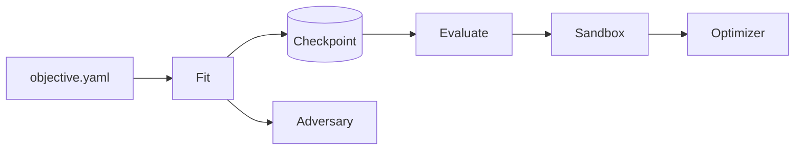
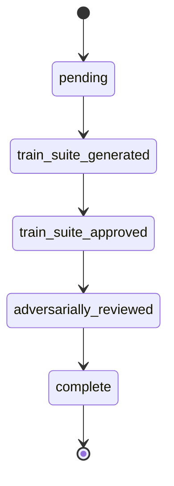

# Architecture

Crucis is an autonomy scaffold that generates, attacks, and validates code through a pipeline of LLM agents and static analysis, providing structured automated feedback so agents can iterate without human intervention.

## System Overview



## Data Flow

1. **Objective intake** -- `intake/objective.py` parses the YAML objective, validates eval expressions, resolves constraint profiles via `constraints/loader.py`. Constraints can be listed flat — the constraint registry auto-classifies them into required (blocking) vs advisory. The legacy `primary:`/`secondary:` format is still supported for backward compatibility.

2. **Fit phase** -- `core/loop.py` iterates through each task:
    - Generates pytest train suites via the generation agent
    - Validates syntax (AST parse) and constraints (static analysis)
    - Presents for user approval (auto-approved by `crucis run`)
    - Runs adversarial review: finds attack vectors, generalization gaps
    - Generates and executes a cheating probe against the tests
    - Saves progress to checkpoint after each task

3. **Evaluation phase** -- `core/loop.py` orchestrates implementation:
    - Builds a curriculum from checkpoint data (`core/curriculum.py`)
    - Sends curriculum + test files to the implementation agent
    - Runs pytest in Docker sandbox (or host fallback)
    - Verifies against hidden holdout evals
    - Retries up to `max_iterations` on failure

4. **Background optimization** (experimental, disabled by default) -- `execution/optimizer.py` queues a job after fit or evaluate. Enable with `optimizer: enabled: true` in `.crucis/settings.yaml`.
    - Spawns a detached worker process
    - Scores candidate policies against baseline using black-box evaluation
    - Promotes winning candidates (manual or auto mode)

## Task State Machine

Each task in the checkpoint progresses through these states:



The fit loop resumes from the last incomplete state on restart.

## File Structure

```
project/
  objective.yaml           # Objective definition
  plan.md                  # Structured generation plan (from crucis run --plan)
  .checkpoint.json         # Task progress and train suite sources
  curriculum.md            # Generated evaluation guide
  constraints/
    profiles.yaml          # Constraint profile definitions
  crucis/prompts/
    templates/             # Jinja2 templates for all prompt rendering
  tests/
    test_<task>.py         # Generated train suites
  src/
    <target_files>.py      # Implementation targets
  .crucis/
    settings.yaml          # Runtime settings
    optimizer/
      active_policy.yaml   # Current steering policy
      status.json          # Optimizer state
      worker.lock          # Prevents concurrent workers
      queue/               # Pending optimization jobs
      runs/
        <run_id>/
          candidate_policy.yaml
          result.json
          report.md
```

## Module Roles

| Module | Purpose |
|--------|---------|
| `__main__.py` | CLI entry point: init, run, status, validate, doctor, promote, optimizer-worker |
| `config.py` | Environment-based configuration (API keys, models, limits) |
| `models.py` | Pydantic models: objectives, checkpoints, constraints, reports |
| `display.py` | Rich terminal output (tables, panels, syntax highlighting) |
| `diagnostics.py` | Environment and workspace diagnostics (`crucis doctor`) |
| `cli/runner.py` | Subprocess wrapper for Claude/Codex agents |
| `core/loop.py` | Top-level fit and evaluation orchestration |
| `core/generation.py` | Test generation phase (generate → validate → review cycle) |
| `core/evaluation.py` | Evaluation phase (implement → verify retry cycle) |
| `core/verification.py` | Shared verification utilities (test running, constraint checking, holdout evals) |
| `core/_shared.py` | Shared helpers: preflight checks, test path collection, optimizer enqueueing, run logging |
| `core/planner.py` | Structured plan generation (`crucis run --plan`) |
| `prompts/__init__.py` | Jinja2 template engine for all prompt rendering |
| `prompts/_filters.py` | Custom Jinja2 filters (path_to_module, bool_label, readable_name) |
| `prompts/templates/` | Jinja2 templates for generation, adversary, probe, evaluation, plan, curriculum, onboarding |
| `core/prompts.py` | Thin prompt builder wrappers delegating to Jinja2 templates |
| `core/adversary.py` | Adversarial review, probe generation and execution |
| `core/curriculum.py` | Markdown curriculum from checkpoint + objective |
| `core/test_generator.py` | Python extraction from LLM responses |
| `intake/objective.py` | YAML objective parsing and validation |
| `intake/scaffold.py` | Workspace scaffolding and agent-driven onboarding (`crucis init`) |
| `constraints/loader.py` | Profile loading, constraint resolution, and auto-classification via the constraint registry |
| `constraints/checker.py` | AST-based static analysis (44 checks — each classified as required or advisory) |
| `constraints/_class_metrics.py` | Class-level metric checkers (methods, fields, lines, WMC per class) |
| `constraints/_module_metrics.py` | Module-level metric checkers (efferent coupling, maintainability index) |
| `constraints/_python_idioms.py` | Python idiom checkers (naming conventions, single-char names, unnecessary else, len-as-condition) |
| `execution/sandbox.py` | Docker-isolated pytest execution |
| `execution/optimizer.py` | Background policy optimization job management |
| `persistence/checkpoint.py` | Checkpoint creation, save, and load |
| `persistence/policy.py` | Policy I/O, candidate management, status tracking |
| `persistence/settings.py` | Settings schema and persistence |
| `persistence/events.py` | Structured JSONL event logging |
| `defaults.py` | Shared utilities: sanitized environment, text excerpting |
| `_compat.py` | Python 3.10 compatibility shim (StrEnum backport) |
| `gepa_optimizer.py` | GEPA-powered policy optimization worker |

## Agent Integration

Crucis uses CLI agents as subprocesses, not API calls:

- **Generation agent** (default: `claude`) -- generates pytest train suites from objectives and constraints. Runs with `--output-format json` and empty `--allowedTools`.
- **Critic agent** (default: `claude`) -- performs adversarial review of generated tests. Same invocation as generation.
- **Implementation agent** (default: `codex`) -- writes code to pass the tests. Runs with `--full-auto` and access to Edit, Write, Read, Bash tools.

Agent selection and model are configured via environment variables or `config.py`:

| Setting | Default | Purpose |
|---------|---------|---------|
| `generation_agent` | `claude` | Agent for test generation |
| `generation_model` | `claude-opus-4-6` | Model for test generation |
| `critic_agent` | `claude` | Agent for adversarial review |
| `critic_model` | `claude-opus-4-6` | Model for adversarial review |
| `implementation_agent` | `codex` | Agent for code implementation |
| `implementation_model` | `gpt-5.3-codex` | Model for code implementation |

## MCP Server

The `crucis/mcp/` package exposes every CLI capability as MCP tools for use by AI agents:

| Module | Purpose |
|--------|---------|
| `mcp/server.py` | FastMCP instance with 19 tools, 7 resources, 5 prompts |
| `mcp/_workspace.py` | Workspace authorization, path traversal prevention, input validation |

The server is a thin integration layer — all business logic stays in the modules listed above. See [MCP Server](mcp-server.md) for the full reference.

## Verification Granularity

Crucis supports two verification modes set in the objective YAML:

- **`task`** (default) -- each task is verified independently with its own pytest run and holdout check. Best for multi-task objectives where tasks are independent.
- **`objective`** -- all tasks are verified together in a single pytest run. Holdout failures are reported as counts only (redacted payloads) to prevent information leakage.
