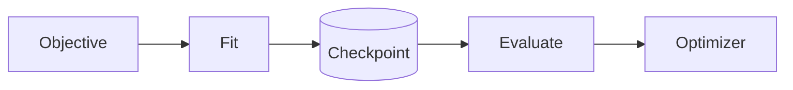
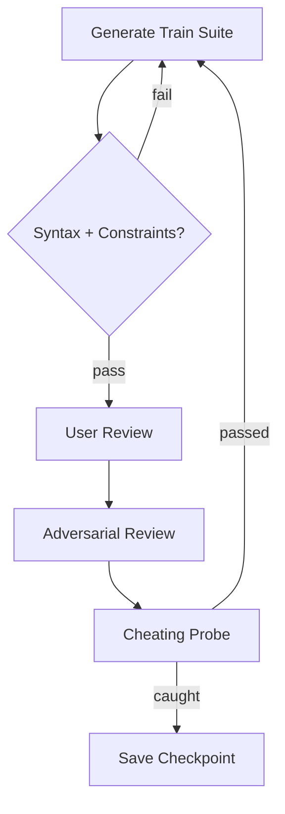
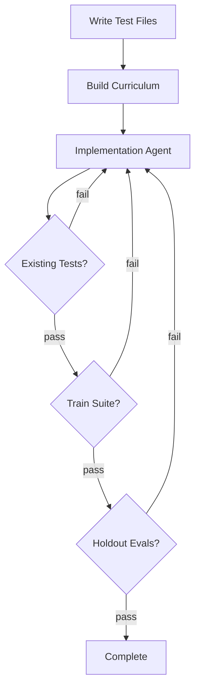
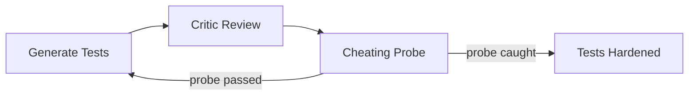

# How It Works

Crucis runs a structured training loop with adversarial hardening:



## Fit Phase



`crucis run` processes each task in the objective sequentially.

### Step 1: Generate Train Suite

The generation agent receives a prompt built from:
- The objective name, description, and signature
- Train eval examples (input/output pairs)
- Primary and secondary constraints from the constraint profile
- Constraint guidance text
- Target file paths (converted to import hints)
- Context file contents (existing code the agent needs to understand)
- Active optimizer policy directives (if any)
- Constraint violation feedback from prior attempts (if retrying)
- Adversarial feedback from prior cycles (if improving)

The agent returns a complete pytest file. Crucis extracts the Python code from the response (handling markdown fences) and validates it:

1. **Syntax check** -- `ast.parse()` on the extracted source
2. **Constraint check** -- AST-based static analysis against primary and secondary gates

If either fails, the violation feedback is appended to the prompt and the generation retries.

### Step 2: User Review

In interactive mode, the train suite is displayed with syntax highlighting:

- **`a` (accept)** -- approve the tests and proceed
- **`e` (edit)** -- open in `$EDITOR` for manual changes
- **`r` (reject)** -- regenerate from scratch

`crucis run` auto-approves by default. In interactive fit mode (advanced), prompts are Rich-styled with labeled shortcuts.

### Step 3: Adversarial Review

The critic agent receives the approved train suite and attacks it, returning a JSON report:

```json
{
  "attack_vectors": ["Hardcode outputs for known inputs"],
  "generalization_gaps": ["No test for empty input"],
  "suggested_probe_tests": ["Test with negative numbers"]
}
```

Each list contains up to 3 plain-string entries.

### Step 4: Cheating Probe

Crucis generates a deliberately cheating implementation -- one that passes all tests by hardcoding, fingerprinting inputs, or using lookup tables. The probe runs against the train suite:

- **Probe fails** -- the tests are robust enough to catch cheating. Proceed.
- **Probe passes** -- the tests have gaps. If holdout evals exist, the probe is also checked against them. Adversarial findings are fed back to the generation prompt and the cycle restarts.

The fit loop runs up to `max_iterations` adversarial cycles (2 in auto mode).

### Resetting Checkpoint State

Use `--reset` to clear the entire checkpoint before starting, or `--reset-task <name>` to clear specific tasks:

```bash
crucis run --reset
crucis run --reset-task my_task
```

These flags are mutually exclusive. When `--reset-task` is used without `--task`, the reset tasks are automatically scoped for processing.

### Step 5: Save Checkpoint

After each task, the checkpoint is saved with:
- Task status (which state in the state machine)
- The approved train suite source code
- The adversarial report (attack vectors, gaps, probe results)

## Evaluation Phase



The evaluation phase takes the checkpoint and generates an implementation.

### Step 1: Write Test Files

Approved train suites from the checkpoint are written to `tests/test_<task_name>.py`.

### Step 2: Build Curriculum

A markdown curriculum is generated from:
- Objective metadata (name, description)
- Target files and their current contents
- Context file contents (existing code relevant to the objective)
- Train suite file paths
- Per-task details: signature, description, train evals, constraints, adversarial findings

This curriculum is the primary context for the implementation agent.

### Step 3: Run Implementation Agent

The implementation agent (default: Codex) receives:
- The curriculum path
- The test file paths
- Error feedback from prior attempts (if retrying)
- Optimizer policy directives (if any)

The agent has access to Edit, Write, Read, and Bash tools and writes code directly to the target files.

### Step 4: Regression Gate

If `existing_tests` are configured, Crucis runs them against the implementation before verifying the generated train suites. This catches regressions in existing functionality. Files that don't exist on disk are silently skipped, so projects without active test suites are unaffected.

### Step 5: Verify Public Tests

Crucis runs pytest against the generated train suites. Verification mode depends on `verification_granularity`:

- **`task` mode** -- each task's test file runs independently. A failure in one task doesn't affect others.
- **`objective` mode** -- all test files run together in a single pytest invocation.

Tests run in the Docker sandbox by default, or on the host with `--no-sandbox`.
Host-mode verification executes `python -m pytest` with workspace-aware import path setup.

### Step 6: Verify Holdout Evals

Hidden holdout evals are never shown to any agent. Crucis dynamically generates ephemeral pytest files that:
1. Discover the target module from `target_files` paths
2. Import the function by name
3. Assert each holdout input/output pair

Holdout failures are reported as counts only -- no payloads are leaked to prevent information leakage to the implementation agent during retries.

### Step 7: Retry or Complete

If verification fails, the error output (trimmed to 1200 chars) is fed back to the implementation agent and the cycle retries. Up to `max_iterations` attempts.

On success, `evaluation_passed: true` is persisted in the checkpoint and a background optimizer job is queued.

## Adversarial Testing



The adversarial system has three components:

1. **Review** -- the critic agent analyzes test quality, identifying attack strategies and gaps
2. **Probe** -- a cheating implementation is generated and tested, measuring actual test robustness
3. **Feedback loop** -- adversarial findings feed back into test generation, producing harder tests

This creates an arms race: better attacks produce better tests, which produce better implementations.

## Error Recovery

- **Agent timeout** -- treated as a failed attempt, retried with the next iteration. Override with `--timeout SECONDS` (default: 300s)
- **Missing agent binary** -- returns `exit_code=-1`, retried
- **Malformed adversarial JSON** -- repaired via `json_repair` library
- **Docker unavailable** -- falls back to host pytest
- **Constraint violations** -- violation details fed back to generation prompt for correction

Error messages include actionable hints where possible (e.g., "Hint: Check the path or run 'crucis init' to create one.").

All long-running phases emit structured JSONL telemetry under `.crucis/logs/`.

## MCP Server Mode

Everything described above is also available via the [MCP server](mcp-server.md). AI agents in Claude Code, OpenCode, or Codex can call Crucis tools directly instead of shelling out to the CLI. The MCP server supports two modes:

- **Pipeline mode** — the agent calls `crucis_run` and Crucis manages the full loop internally.
- **Step-by-step mode** — the agent acts as generator/critic/implementer itself, using tools like `crucis_get_prompt`, `crucis_submit_test_suite`, and `crucis_verify_implementation`.

See [MCP Server](mcp-server.md) for setup and tool reference.

---

See [CLI Reference](cli-reference.md) for all commands and options.
